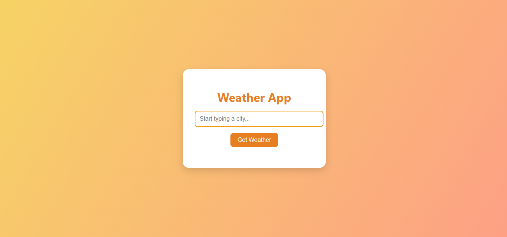

# 🌦️ Weather App - CSS Styling Lab

## Overview

This project is a hands-on CSS styling lab focused on building a responsive and visually appealing weather application. The lab combines HTML structure creation with advanced CSS styling techniques to create a modern, interactive weather app interface.



## 🎯 Learning Objectives

- **HTML Structure**: Practice writing semantic HTML with proper element organization
- **CSS Layout**: Master flexbox and grid layouts for responsive design
- **Interactive Styling**: Implement hover states, transitions, and dynamic styling
- **Component Design**: Create reusable, well-styled UI components
- **Responsive Design**: Ensure the app works across different screen sizes

## 📁 Project Structure

```
w2_css_w4_weather_app/
├── README.md           ← Project overview (this file)
├── package.json        ← Project configuration
├── assets/
│   └── Weatherapp_01.PNG ← Design reference image
└── lab/
    ├── readme.md       ← Detailed lab instructions
    ├── index.html      ← Main HTML file (to be created)
    ├── style.css       ← CSS styling (your main focus)
    ├── app.js          ← JavaScript functionality (provided)
    ├── weatherData.js  ← Weather data handling (provided)
    └── tests/
        └── test-weather-lab.js ← Testing utilities (provided)
```

## 🧪 Testing Your Work

The project includes automated tests to help verify your implementation:

```bash
# Navigate to the project root
cd /path/to/w2_css_w4_weather_app

# Run the tests
npm test
```

The tests will check:
- HTML structure and semantic elements
- CSS styling and layout properties
- Required classes and IDs
- Responsive design implementation

## 🚀 Getting Started

1. **Navigate to the lab directory**: All your work will be done in the `/lab` folder
2. **Read the detailed instructions**: Check `lab/readme.md` for step-by-step guidance
3. **Create your HTML structure**: Build the weather app layout in `index.html`
4. **Style with CSS**: Focus on making it beautiful and responsive using `style.css`
5. **Test your work**: The JavaScript files will handle the weather functionality

## 🛠️ What You'll Build

- **Interactive Input Field**: City search with autocomplete suggestions
- **Weather Display Card**: Clean, card-based weather information display
- **Responsive Layout**: Mobile-first design that works on all devices
- **Modern UI Elements**: Buttons, inputs, and cards with hover effects and transitions

## 📋 Key Features to Implement

- Semantic HTML structure using proper elements (`header`, `main`, `section`)
- Responsive layout using flexbox or CSS grid
- Interactive form elements with proper styling
- Dynamic dropdown suggestions styling
- Weather information card with clean typography and spacing
- Smooth transitions and hover effects
- Cross-browser compatible CSS

## 🎨 Design Focus Areas

- **Typography**: Clean, readable font choices and hierarchy
- **Color Scheme**: Thoughtful color palette with good contrast
- **Spacing**: Consistent margins, padding, and component spacing
- **Visual Hierarchy**: Clear information organization and emphasis
- **Accessibility**: Proper contrast ratios and interactive element styling

## 📚 Skills Practiced

- Semantic HTML structure
- CSS Flexbox and Grid layouts
- Responsive design principles
- CSS transitions and animations
- Form styling and user interaction design
- Component-based styling approach

## 🎯 Success Criteria

Your weather app should be:
- ✅ Visually appealing and professional-looking
- ✅ Fully responsive across device sizes
- ✅ Accessible with proper contrast and interactive states
- ✅ Well-organized with clean, readable code
- ✅ Functionally complete with all required UI elements

---

> **Ready to start?** Head over to the `lab/` directory and follow the detailed instructions in `lab/readme.md` to begin building your weather app!
