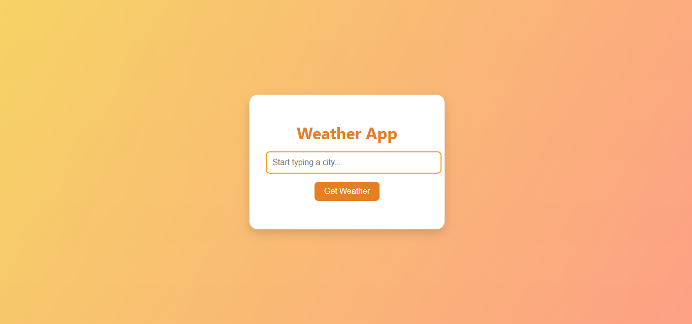

# CSS Styling — Weather App

**Estimated time:** 3–4 hours

---

## Overview

This is a hands-on CSS styling lab focused on building a responsive and visually appealing weather application. You'll combine HTML structure creation with CSS styling techniques to create a modern, interactive weather app interface.



## 🎯 Learning Objectives

- **HTML Structure**: Practice writing semantic HTML with proper element organization
- **CSS Layout**: Master flexbox and grid layouts for responsive design
- **Interactive Styling**: Implement hover states, transitions, and dynamic styling
- **Component Design**: Create reusable, well-styled UI components
- **Responsive Design**: Ensure the app works across different screen sizes

---

## How this lab works

```
w2_css_w4_weather_app/
├── lab/
│   ├── instructions.md   ← Start here. Step-by-step tasks.
│   ├── index.html        ← You will create this
│   ├── style.css         ← Your main focus
│   ├── app.js            ← Provided, do not edit
│   ├── weatherData.js    ← Provided, do not edit
│   ├── assets/           ← Reference image
│   ├── tests/            ← Automated tests
│   └── package.json      ← Test dependencies and scripts
├── lab.json              ← Submission config (don't edit)
├── submit.sh             ← Run this when you're done
└── README.md             ← You are here
```

---

## Step 1 — Do the lab

Open `lab/instructions.md` and work through the tasks in order.

Your work goes inside the `lab/` directory. Do not modify files outside of it.

To run the automated tests as you work:

```bash
cd lab
npm install
npm test
```

An HTML test report is generated at `lab/tests/test-results.html` after each run — open it in your browser for a visual breakdown of passed/failed checks.

---

## Step 2 — Submit

When all tasks are complete, from the project root run:

```bash
bash submit.sh
```

This runs automated checks and records your submission in Canvas. You can submit multiple times — the most recent submission counts.

---

## Getting stuck

1. Re-read the relevant section of `lab/instructions.md`
2. Run the tests and read the failure messages closely — they tell you exactly what's missing
3. Search the error message — copy it exactly into Google or your AI tool
4. Ask in the group chat — share your error message and what you've already tried
5. Escalate to your mentor only if steps 1–4 haven't resolved it

---

## 🛠️ What you'll build

- **Interactive Input Field**: City search with autocomplete suggestions
- **Weather Display Card**: Clean, card-based weather information display
- **Responsive Layout**: Mobile-first design that works on all devices
- **Modern UI Elements**: Buttons, inputs, and cards with hover effects and transitions

## 📋 Key features to implement

- Semantic HTML structure using proper elements (`header`, `main`, `section`)
- Responsive layout using flexbox or CSS grid
- Interactive form elements with proper styling
- Dynamic dropdown suggestions styling
- Weather information card with clean typography and spacing
- Smooth transitions and hover effects
- Cross-browser compatible CSS

## 🎨 Design focus areas

- **Typography**: Clean, readable font choices and hierarchy
- **Color Scheme**: Thoughtful color palette with good contrast
- **Spacing**: Consistent margins, padding, and component spacing
- **Visual Hierarchy**: Clear information organization and emphasis
- **Accessibility**: Proper contrast ratios and interactive element styling

## 🎯 Success criteria

Your weather app should be:
- ✅ Visually appealing and professional-looking
- ✅ Fully responsive across device sizes
- ✅ Accessible with proper contrast and interactive states
- ✅ Well-organized with clean, readable code
- ✅ Functionally complete with all required UI elements
- ✅ Pass all automated tests (check your test report!)

---

## This week's focus

> Practicing semantic HTML structure and CSS layout techniques (flexbox/grid) by building a real, interactive UI from scratch.

---

*Coding System Wave 2*
