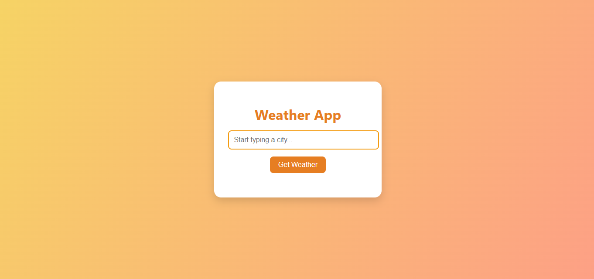

# 🌦️ Lab: CSS Styling for a Local Weather App

## 🎯 Objective
In this lab, you will build a small weather app using **your own HTML** and style it with **pure CSS**. You will be given a working JavaScript file that handles data—you won’t touch that. Your goal is to create the structure with HTML and make it beautiful with CSS.


---

## 📁 Starter Files
You will receive the following files:

```
weather-lab/
├── index.html        ← You will write this
├── weatherData.js    ← Do not edit
├── app.js            ← Do not edit
└── style.css         ← Your focus for this lab
```

> ✅ You will write `index.html` and style it in `style.css`.

## 🧱 Step 1: Create the HTML Structure

Build the following structure in `index.html`:

- A page title (`<h1>Weather App</h1>`) inside a `<header>` tag
- An input field to type the city name (`<input type="text">`) inside a styled container
- A button to get the weather (`<button>Get Weather</button>`)
- A container to show suggestions (`<ul class="suggestions"></ul>`) under the input
- A container to display the weather info (`<div id="weatherInfo"></div>`) inside a `<section>`
- Use semantic HTML elements where possible: `<main>`, `<header>`, `<section>`, `<footer>`

Example layout (structure only):
```html
<header>
  <h1>Weather App</h1>
</header>
<main>
  <div class="input-group">
    <input type="text" id="cityInput" placeholder="Enter city...">
    <button id="getWeather">Get Weather</button>
    <ul class="suggestions"></ul>
  </div>
  <section id="weatherInfo"></section>
</main>
```

## 🎨 Step 2: Style the Page with CSS

Make the app visually appealing:

- Set a full-page background color or background image
- Use a modern, readable font
- Center the main content vertically and horizontally

> ✨ Bonus: You might have to use **flexbox or grid** to position major elements!

## 🖼️ Step 3: Style the Input and Button

- Give input and button uniform height
- Add internal padding and border-radius
- Add a hover/active style for the button
- Ensure good color contrast for accessibility
- Input should stretch to take up available space on wide screens

## 📜 Step 4: Dropdown Styling

The dropdown appears **dynamically** under the input when users type:

- Style the suggestions list to look like a popup menu
- Use spacing, colors, and hover states to make items interactive
- Prevent list from overlapping weirdly on small screens

## 📦 Step 5: Weather Info Box

Style the weather output so it looks like a **weather card**:

- Use shadows, border-radius, and light colors
- Display icon, temperature, and weather description clearly
- Use **flexbox** or **grid** for layout inside the card
- Optional: change background or accent color depending on the weather type

## ✅ Final Touches

- Use transitions for buttons and hover states
- Make the input field look interactive
- Test across multiple screen sizes
- Clean up any overlapping or scroll issues

## 🚀 Submission Instructions

When you're done:
1. Save all changes
2. Ensure your HTML is semantic and valid
3. Push your project to GitHub (or zip and upload if instructed)

### Git Quick Start (if needed):

```bash
git init
git add .
git commit -m "Complete advanced CSS layout for weather app"
git remote add origin https://github.com/your-username/weather-lab.git
git branch -M main
git push -u origin main
```

## 🌟 Stretch Goals (Optional)

- Add CSS animations (e.g. fade in weather card)
- Create a custom weather icon style
- Make the UI themeable (light/dark)
- Add a footer with credits and link to your GitHub

💡 Don't worry if it doesn't look exactly like the screenshot. The goal is to practice layout and styling techniques you've learned so far.